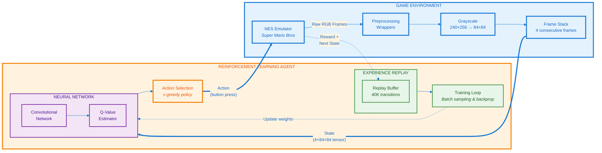

# Super Mario Bros RL Agent (DDQN on Metal/MPS)

A Deep Reinforcement Learning agent that learns to play *Super Mario Bros* (NES) from scratch using **Double Deep Q-Learning (DDQN)**. Optimized for **Apple Silicon & AMD GPUs** via Metal Performance Shaders (MPS)—no NVIDIA CUDA required.

   

---

## What This Does

Watch an AI learn to play Super Mario Bros from raw pixels, with no game knowledge or human demonstrations. Starting from random button mashing, the agent discovers jumping, dodges enemies, and optimizes speedruns through reinforcement learning.

**Key Features:**
- Pure pixel-to-action learning with convolutional neural networks
- Optimized for Mac hardware (Apple Silicon M1/M2/M3 & AMD GPUs)
- Efficient memory management for 4GB VRAM constraints
- Frame stacking for motion perception
- Double DQN architecture to prevent overestimation bias

---

## The Architecture

The agent operates in a classic RL loop: observe the environment (pixels) → decide on an action → receive reward → learn from experience.

### System Diagram



---

## Reinforcement Learning Concepts

### 1. Double Deep Q-Learning (DDQN)

Traditional Q-Learning uses lookup tables to store action values. Super Mario's state space (millions of pixel combinations) makes this impossible. We approximate the Q-function using a **Convolutional Neural Network**.

**The Double DQN Twist:**
- **Online Network:** The active brain that plays and learns continuously
- **Target Network:** A slowly-updated copy that provides stable learning targets, preventing the "moving target" problem where the network chases its own predictions

This separation significantly reduces overestimation bias common in standard DQN.

### 2. Frame Stacking: Perceiving Motion from Still Images

A single frame can't distinguish between Mario standing still or mid-jump. The solution: stack **4 consecutive frames** as input. This temporal context allows the CNN to implicitly understand velocity, momentum, and trajectory—purely from pixels.

### 3. Epsilon-Greedy Exploration

Balancing the exploration-exploitation tradeoff:
- **Early Training (ε = 1.0):** Random actions to discover that jumping avoids enemies
- **Mid Training (ε = 0.5):** Mix of random exploration and learned behavior  
- **Late Training (ε = 0.1):** Mostly exploit learned policy, occasional exploration

Epsilon decays linearly from 1.0 → 0.1 over the first 200,000 steps.

### 4. Experience Replay

Rather than learning from experiences sequentially (which creates correlated, biased updates), we:
1. Store experiences in a replay buffer (capacity: 40,000 transitions)
2. Sample random minibatches during training
3. Break temporal correlations and improve sample efficiency

---

## Installation & Usage

### Prerequisites

- **Python:** 3.9 or higher
- **macOS:** 12.3+ (Monterey or later for MPS support)
- **Hardware:** Apple Silicon (M1/M2/M3) or Intel Mac with AMD GPU

### Setup

```bash
# Clone the repository
git clone https://github.com/yourusername/super-mario-rl-mps.git
cd super-mario-rl-mps

# Create virtual environment
python3 -m venv venv
source venv/bin/activate

# Install dependencies
pip install torch torchvision gym-super-mario-bros gymnasium \
    "numpy<2" "opencv-python<4.10" matplotlib
```

### Training the Agent

```bash
python3 main.py
```

**Training Modes:**
- **Headless (Default):** `render_mode="rgb_array"` for maximum speed
- **Visual:** Change to `render_mode="human"` in `main.py` to watch Mario play (warning: significantly slows training)

**Monitoring Progress:**
- Episode rewards logged to console every 10 episodes
- Model checkpoints saved to `checkpoints/` directory
- Training curves plotted with matplotlib

---

## Expected Learning Progression

| Episode Range | Behavior |
|--------------|----------|
| **0-500** | Random flailing; frequent deaths in first pit |
| **500-1500** | Learns basic jump timing; clears first obstacles occasionally |
| **1500-3000** | Consistent survival past initial section; explores level structure |
| **3000-5000+** | Optimizes for speed; actively pursues enemies for points; completes World 1-1 |

**Training Time:** ~8-12 hours on 2019 MBP to reach competent play (episode ~4000).

---

## Project Structure

```
super-mario-rl-mps/
│
├── main.py          # Entry point: environment loop & training orchestration
├── agent.py         # DDQN algorithm: replay buffer, loss computation, training step
├── model.py         # CNN architecture: 3 conv layers + 2 fully connected layers
├── wrappers.py      # Preprocessing pipeline: grayscale, resize, frame stacking
│
├── checkpoints/     # Saved model weights (created during training)
└── README.md        # You are here
```

### Component Details

**`main.py`**  
Initializes the Super Mario environment, creates the agent, and runs the training loop. Handles episode management, logging, and checkpoint saving.

**`agent.py`**  
Core RL logic: implements DDQN with experience replay, epsilon-greedy action selection, and periodic target network updates. Contains the mathematical heart of the learning algorithm.

**`model.py`**  
The neural network "brain." A CNN designed for 84×84 grayscale input with 4-frame stacks. Architecture chosen to balance representational capacity with training stability.

**`wrappers.py`**  
Preprocessing transformations applied to raw game observations. Converts 240×256 RGB frames into memory-efficient 84×84 grayscale stacks suitable for CNN input.

---

## Implementation Notes: Mac Optimization

Built for a **2019 MacBook Pro (i9 + Radeon Pro 560X, 4GB VRAM)**—significantly different constraints than typical NVIDIA setups.

### Hardware Acceleration Without CUDA

**Challenge:** Most RL frameworks assume NVIDIA CUDA availability.

**Solution:** Implemented PyTorch MPS (Metal Performance Shaders) backend for Apple GPUs:

```python
# Automatic device detection
self.device = "mps" if torch.backends.mps.is_available() else "cpu"
```

**Result:** 5-10× speedup over CPU-only training on both Apple Silicon and AMD discrete GPUs.


### Dependency Compatibility (NumPy 2.0 Breaking Changes)

**Challenge:** `gym-super-mario-bros` uses precompiled C++ bindings compatible only with NumPy 1.x. NumPy 2.0 changed its C API.

**Solution:** Strict version pinning in requirements:
```
numpy<2.0.0
opencv-python<4.10
```

These constraints prevent silent segfaults from ABI mismatches.

---
